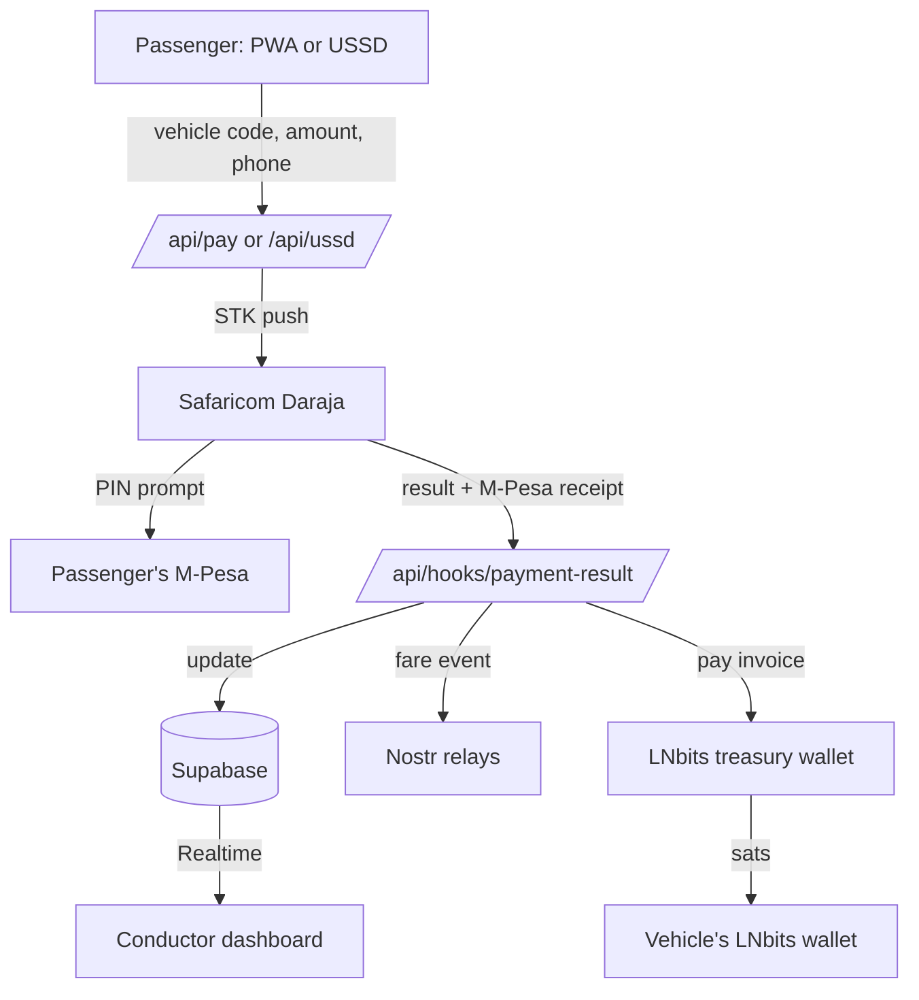
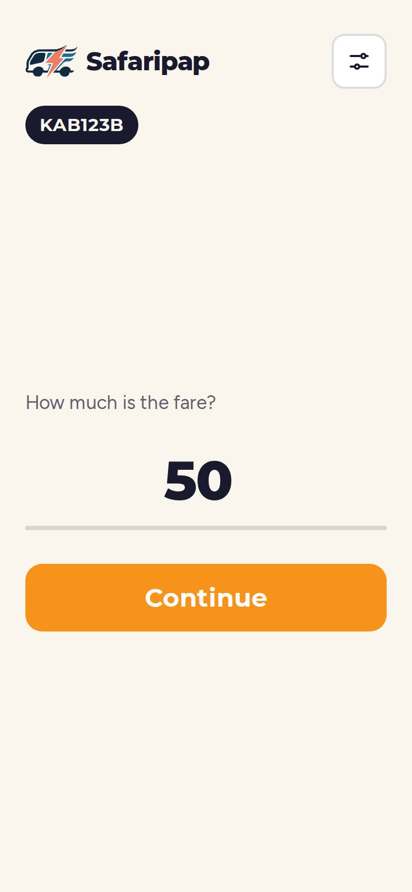
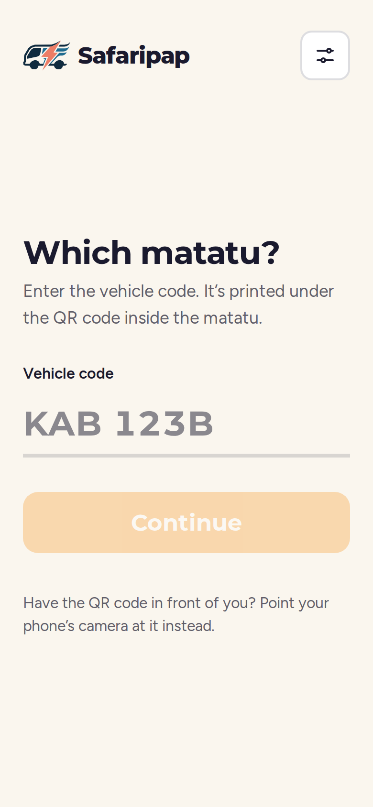
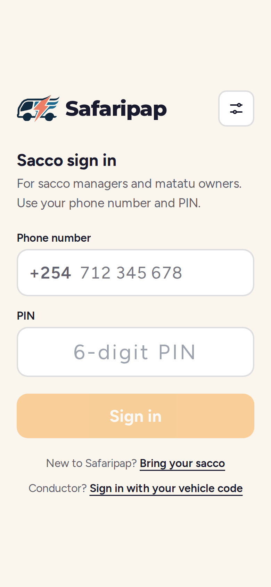
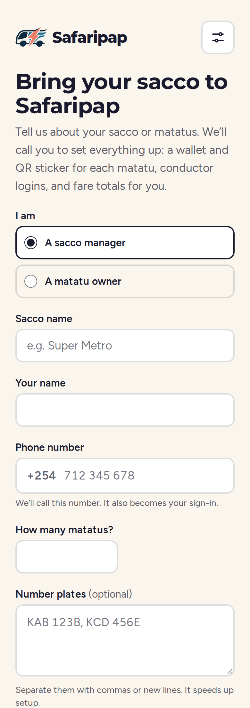
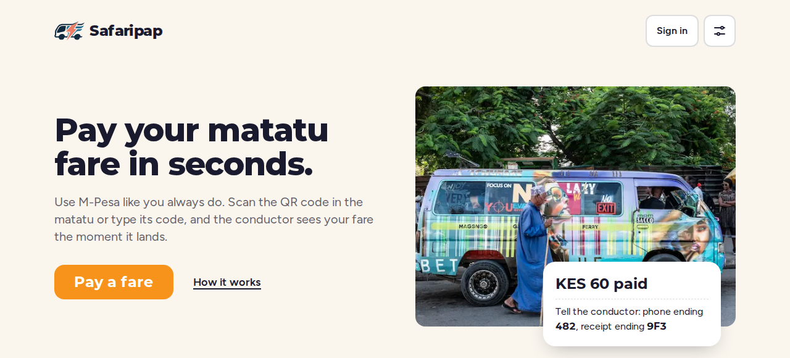
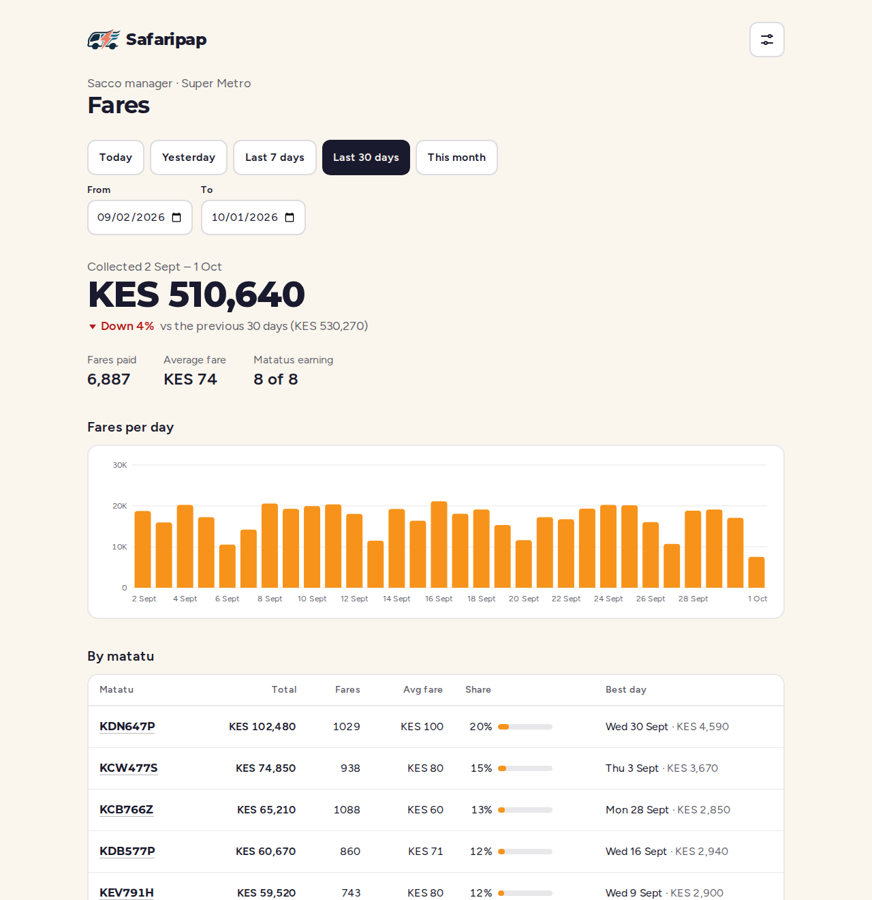

 <div align="center">

# SAFARIPAP

### Bitcoin Lightning fare payments for Kenyan matatus

Pay with ordinary M-Pesa. Settle instantly in Bitcoin, straight into the vehicle's own wallet.

<br />


<br />

[The Problem](#the-problem) &nbsp;|&nbsp; [The Solution](#the-solution) &nbsp;|&nbsp; [Why Lightning](#why-lightning-and-why-bitcoin) &nbsp;|&nbsp; [How It Works](#how-it-works) &nbsp;|&nbsp; [Screenshots](#screenshots) &nbsp;|&nbsp; [Security](#security-model) &nbsp;|&nbsp; [Setup](#local-setup) &nbsp;|&nbsp; [Status](#project-status)

</div>

<br />

---

## At a Glance

| | |
| :-- | :-- |
| **Passenger** | Scans a QR code or dials a USSD code, then pays with M-Pesa from their own phone |
| **Conductor** | Watches fares land on a live dashboard, with no need to inspect anyone's phone |
| **Owner or SACCO** | Receives fares as Bitcoin into a wallet tied to one specific vehicle, and sees daily totals per vehicle on their own dashboard |
| **Transparency** | Every paid fare is published to Nostr, and each night every matatu's day is signed as a report anyone can check at `/verify` |

---

## The Problem

Paying a matatu fare by M-Pesa today usually means handing your phone, or at least its screen, to a stranger. The passenger sends the money, then shows the confirmation to the conductor, who checks it by eye against the fare.

| Issue | What happens |
| :-- | :-- |
| **Exposure** | The conductor sees the passenger's phone, and with it their balance, transaction history and contacts. Passengers seen carrying money or a valuable phone become easier targets for theft and social engineering, on the vehicle and after they get off. |
| **Friction** | Every payment needs manual confirmation, one passenger at a time, while the vehicle is loading or moving. This slows boarding and leads to queues, disputes and missed fares. |
| **Trust** | A message on a screen is easy to fake, and the conductor has no independent way to confirm that money actually arrived. Owners and SACCOs have no reliable per-vehicle record of what each matatu earned. |

---

## The Solution

Safaripap removes the phone-showing step. The passenger pays from their own phone, using a QR code or a USSD code, and never has to hand the device to anyone. The fare then appears on the conductor's live dashboard, driven by a signed payment confirmation from the payment provider rather than a screen shown by the passenger.

Each successful payment is settled as Bitcoin into that specific vehicle's own Lightning wallet, and the fare is published to Nostr, with a signed daily report per vehicle that anyone can check. The passenger is not exposed, the conductor confirms against a trusted source, and the owner gets a clear record per vehicle.

---

## Why Lightning and Why Bitcoin

Safaripap is not a payments app with Bitcoin attached. The design depends on properties that ordinary payment rails do not give a matatu.

| Property | What it means for a matatu |
| :-- | :-- |
| **Each vehicle holds its own funds** | Every matatu has its own Lightning wallet and Lightning Address. Fares settle directly into it, with no shared till or paybill account between the passenger and the vehicle. Funds can be withdrawn to a Lightning wallet the owner controls. |
| **Built for small, fast payments** | Lightning settles low-value payments in seconds, which suits fares of a few tens of shillings. |
| **Open and borderless** | Bitcoin and Lightning are open protocols. A SACCO is not tied to one provider's platform to hold or move its earnings. |
| **Public, checkable record** | Fares and signed daily reports are published to Nostr, an open protocol with many independent relays. A report carries a SHA-256 hash of the day's fare list; `/verify` fetches it straight from the relays and recomputes the hash in the browser, so anyone can see the numbers weren't changed after signing. No phone numbers or M-Pesa receipts are ever published. |
| **Familiar for the passenger** | The passenger still pays with M-Pesa. There is no new wallet, no seed phrase and no learning curve. Bitcoin is the settlement layer underneath. |

---

## Who It Serves

<table>
  <tr>
    <td width="33%" valign="top">
      <h4>Passengers</h4>
      Pay a fare without handing over their phone, so balances and contacts stay private. Works from a QR code on a smartphone or a USSD code on any phone, including feature phones with no internet.
    </td>
    <td width="33%" valign="top">
      <h4>Conductors</h4>
      See each fare arrive on a live dashboard scoped to their own vehicle, without inspecting passengers' phones or relying on screenshots. Sign in with a vehicle code and PIN.
    </td>
    <td width="33%" valign="top">
      <h4>SACCOs and Owners</h4>
      Receive fares into a wallet tied to a specific vehicle, with a public receipt for each payment. Sign in with a phone number and PIN to see totals by day and by vehicle: a manager sees the whole SACCO, an owner sees only their own matatus.
    </td>
  </tr>
</table>

---

## How It Works



| Step | Stage | Description |
| :-: | :-- | :-- |
| 1 | **Initiate** | The passenger opens a vehicle link (`/pay/<vehicleCode>`), typically from a QR code inside the vehicle, or dials a USSD code (`*XXX#`) from any phone. |
| 2 | **Pay** | They enter the fare and their M-Pesa number. The app sends a Daraja STK push, and Safaricom's own PIN prompt appears on their phone. The fare lands in the paybill. |
| 3 | **Verify** | Daraja calls `/api/hooks/payment-result` (token-checked) with the result and the M-Pesa receipt, and the fare is marked paid or failed. If that callback is slow, the pay page asks Daraja directly after 30 seconds (STK query) and the receipt fills in when the callback lands. |
| 4 | **Settle** | Once paid, the pre-funded LNbits treasury wallet pays an invoice from the vehicle's wallet for the fare's value in sats (`src/lib/treasury.ts`). A fare is claimed before it's paid, so it is never paid twice; a low treasury leaves it to retry after a top-up. |
| 5 | **Monitor** | The conductor signs in at `/login` with a vehicle code and PIN. `/dashboard/<vehicleCode>` shows only that vehicle's fares and updates live through Supabase Realtime. |
| 6 | **Publish** | Each paid fare is published to Nostr (amount and vehicle only). Just after midnight a job signs each matatu's day as a report with a hash of its fare list, and tidies any fare that didn't finish (asks Daraja, retries settlement, re-publishes missed events). |
| 7 | **Report** | SACCO managers and matatu owners sign in at `/manage/login` with a phone number and PIN. `/manage` shows fare totals for any date range: the period total against the previous period, fares per day, totals per vehicle, and a spreadsheet download. |

New SACCOs ask to join at `/join`. Safaripap staff review requests in the admin area (`/admin`) and onboard each matatu in about a minute: the app creates its LNbits wallet and Lightning Address, saves the vehicle, creates the conductor login, and produces a printable QR sticker.

---

## Screenshots

<table>
  <tr>
    <td width="25%" align="center"><br /><sub>Pay a fare</sub></td>
    <td width="25%" align="center"><br /><sub>No QR? Type the vehicle code</sub></td>
    <td width="25%" align="center"><br /><sub>Sacco sign-in</sub></td>
    <td width="25%" align="center"><br /><sub>Bring your sacco</sub></td>
  </tr>
</table>


<p align="center"><sub>Landing page</sub></p>


<p align="center"><sub>Sacco manager dashboard, shown with generated sample data</sub></p>

---

## Security Model

| Concern | How it is handled |
| :-- | :-- |
| **M-Pesa PIN** | Entered only on Safaricom's own STK prompt on the passenger's phone. Safaripap never displays a PIN field and never receives or stores a PIN. |
| **Payment authenticity** | Every Bitika webhook is verified with an HMAC signature before the transaction is updated. Status changes are never accepted on trust. |
| **Conductor access** | Conductors sign in with a vehicle code and PIN. Each dashboard is scoped to a single vehicle and enforced by Supabase Row Level Security, not just by the interface. |
| **Passenger privacy** | Conductors only ever receive the last 3 digits of a passenger's phone number and receipt. Column-level grants keep full numbers out of their queries and the realtime feed. Searching by a full M-Pesa receipt is matched on the server, which returns only the matching rows. |
| **Manager and owner access** | Managers and owners sign in with a phone number and PIN. Every dashboard request is checked on the server: a manager gets their SACCO's vehicles, an owner only the vehicles linked to them. |
| **Admin** | Onboarding, stickers, accounts and demo data live under `/admin`, protected by a passcode (`ADMIN_PASSCODE`) and not linked from the public site. The public `/join` form only records a request; it cannot create wallets or logins. |
| **Demo data** | Placeholder vehicles used to fill the SACCO dashboard are flagged as demo, labelled on screen, and refused by the payment API and USSD. Their Lightning Address is on a reserved `.invalid` domain, so they can never be paid. |
| **Privileged keys** | The Supabase service role key and Bitika credentials exist only on the server. The browser uses the anon key, limited by Row Level Security. |
| **Funds custody** | Each vehicle has its own LNbits wallet, so one vehicle's funds are not pooled with another's. |
| **Relay failures** | Nostr publishing is non-blocking. A slow or unavailable relay never delays or fails a payment; each fare records its event id, and the daily job re-publishes any that didn't reach a relay. |
| **Public data** | Nostr events carry amounts and vehicle codes only. Phone numbers and M-Pesa receipts never leave the server; a daily report's hash covers the last 3 receipt characters so a passenger can find their own fare at `/verify`. |
| **Input handling** | Phone numbers are normalized server-side (`07`, `01` and `254` formats are accepted) before reaching the payment provider. |

> [!WARNING]
> Never commit `.env`. It is listed in `.gitignore`; verify this before every push.

---

## Technology

| Layer | Technology | Purpose |
| :-- | :-- | :-- |
| Application | Next.js 14 (App Router), TypeScript, Tailwind | Passenger PWA, conductor dashboard, API routes |
| Data | Supabase (Postgres and Realtime) | SACCOs, vehicles, transactions, live dashboard feed |
| Payments | Safaricom Daraja (M-Pesa STK push) + LNbits treasury | Collects fares in KES, then pays each vehicle in sats. [Bitika](https://bitika.xyz) is still in the code but switched off (see `src/lib/collect.ts`) |
| Custody | LNbits | One Lightning wallet and Lightning Address per vehicle |
| Transparency | Nostr (NIP-78 app data, kind 30078) | Public fare events and signed daily reports with a checkable hash |
| Access | Africa's Talking | USSD channel for passengers without smartphones |

<details>
<summary><strong>Repository structure</strong></summary>

<br />

```
src/
  app/
    page.tsx                            Landing page
    pay/page.tsx                        Enter a vehicle code (no QR to hand)
    pay/[vehicleCode]/page.tsx          Passenger PWA
    login/page.tsx                      Conductor sign-in (vehicle code + PIN)
    dashboard/[vehicleCode]/page.tsx    Conductor dashboard (Supabase Realtime, search)
    sacco/[saccoId]/page.tsx            Today's SACCO totals from public Nostr fare events (not shown to conductors)
    verify/page.tsx                     Public check of a matatu's day against its signed Nostr report
    manage/login/page.tsx               Manager and owner sign-in (phone + PIN)
    manage/page.tsx                     Fare metrics dashboard for managers and owners
    join/page.tsx                       Request to join, for new SACCOs and owners
    signin/page.tsx                     Choose conductor or SACCO sign-in
    admin/                              Staff area: requests, onboarding, stickers,
                                        managers and owners, demo data
    api/
      pay/route.ts                      PWA payment initiation
      ussd/route.ts                     Africa's Talking USSD webhook
      hooks/payment-result/route.ts     Daraja STK callback (token-checked)
      webhooks/bitika/route.ts          Bitika status webhook (Bitika is switched off)
      transactions/[code]/route.ts      Status polling for the PWA
      vehicles/[code]/route.ts          Vehicle lookup
      dashboard/search/route.ts         Full-receipt search for conductors
      manage/                           Manager and owner data (who am I, insights)
      join/route.ts                     Join requests
      admin/                            Staff APIs (passcode session)
  components/                           Shared UI (logo, header, nav, settings, charts)
  lib/
    collect.ts                          Starts a fare's M-Pesa collection (Daraja)
    daraja.ts                           Daraja STK push, query and callback parsing
    stk-outcome.ts                      Applies an STK result: paid, receipt, settle
    treasury.ts                         Pays vehicles their sats from the treasury
    bitika.ts                           Bitika API client (switched off)
    lnbits.ts                           LNbits wallets and Lightning Addresses
    onboarding.ts                       Onboard a vehicle end to end
    members.ts                          Manager and owner accounts and access
    insights.ts                         Fare metrics (Nairobi days)
    demo-data.ts                        Demo vehicles and fare history
    supabase-admin.ts                   Server-side Supabase client (service role)
    supabase-browser.ts                 Browser Supabase client (anon key)
    phone.ts                            Kenyan phone normalization (07 / 01 / 254 to 254)
    nostr-events.ts                     Nostr event shapes and the report hash (shared with the browser)
    nostr.ts                            Signing and publishing to Nostr relays
    nostr-report.ts                     Signed daily report per vehicle
    sweep.ts                            Daily tidy-up of fares that didn't finish
supabase/
  schema.sql                            Full database schema
  migrations/                           Changes for an existing project, in date order
tests/                                  Vitest unit and route tests
```

</details>

---

## Environment Variables

| Variable | Used by | Notes |
| :-- | :-- | :-- |
| `NEXT_PUBLIC_SUPABASE_URL` | Client and server | Supabase project URL |
| `NEXT_PUBLIC_SUPABASE_ANON_KEY` | Client | Supabase anon (public) key |
| `SUPABASE_SERVICE_ROLE_KEY` | Server only | Full-access key. Never expose to the browser |
| `DARAJA_BASE_URL`, `DARAJA_CONSUMER_KEY`, `DARAJA_CONSUMER_SECRET`, `DARAJA_SHORTCODE`, `DARAJA_PASSKEY` | Server only | Safaricom Daraja app credentials and paybill (see `.env.example`) |
| `DARAJA_CALLBACK_BASE_URL` | Server only | Public HTTPS address Daraja calls back to, normally the production URL |
| `DARAJA_CALLBACK_TOKEN` | Server only | Long random string checked on every callback |
| `LNBITS_TREASURY_ADMIN_KEY` | Server only | Admin key of the pre-funded treasury wallet that pays vehicles their sats |
| `BTC_KES_FALLBACK`, `DEMO_SATS_PER_KES` | Server only | KES/BTC rate if the live price is down; optional fixed sats per KES for demos |
| `ANTHROPIC_API_KEY` | Server only | Optional. Enables the Claude-written summary on the Forecast tab |
| `BITIKA_API_KEY`, `BITIKA_WEBHOOK_SECRET` | Server only | Unused while Bitika is switched off |
| `LNBITS_HOST` | Server only | Your LNbits instance, e.g. `https://your-instance.lnbits.com` |
| `LNBITS_ADMIN_KEY` | Server only | Admin key of the super user's wallet. Every vehicle wallet is created under the same account |
| `LNBITS_ACCESS_TOKEN` | Server only | Account access token (from an LNbits access control list) allowed to create wallets. LNbits 1.x refuses a wallet admin key for this |
| `NOSTR_SECRET_KEY_HEX` | Server only | Key that signs fare events and daily reports. Generate with `node scripts/gen-nostr-key.mjs` |
| `NEXT_PUBLIC_NOSTR_APP_PUBKEY` | Client | Public key matching the secret above, used to read fares and check reports |
| `CRON_SECRET` | Server only | Long random string; Vercel sends it to the daily job (`/api/cron/daily`), which refuses anything else |
| `ADMIN_PASSCODE` | Server only | Passcode for the staff area at `/admin` |
| `NEXT_PUBLIC_APP_URL` | Server | The deployed site's address. QR stickers point here, so a sticker printed from a laptop never points at `localhost` |

---

## Local Setup

**1. Install dependencies**

```bash
npm install
```

**2. Configure the environment.** Create a `.env` file with the variables above.

**3. Apply the database schema.** Run `supabase/schema.sql` in the Supabase SQL editor. On an existing project, run the files in `supabase/migrations/` instead, in date order. Then enable Realtime on the `transactions` table under Database, Replication.

**4. Set up LNbits.** On your LNbits instance (for example [LNbits SaaS](https://my.lnbits.com)), check under Server, Funding Source that it uses a real Lightning backend, not FakeWallet. Enable the LNURLp extension. Create an access control list that may create wallets, generate a token for it, and set it as `LNBITS_ACCESS_TOKEN`.

**5. Onboard vehicles.** Start the app (step 7), open `/admin`, enter `ADMIN_PASSCODE`, and use **Onboard a matatu**. It creates the vehicle's LNbits wallet and Lightning Address, saves the vehicle and its SACCO, creates the conductor login, and shows the PIN once with a printable QR sticker. Lost stickers can be reprinted under **Stickers**.

**6. Add managers and owners.** Under **Managers & owners** in `/admin`, create sign-ins for SACCO managers and matatu owners and assign owners their vehicles. To fill the SACCO dashboard for a demo, **Demo data** adds placeholder vehicles with a realistic fare history.

A conductor's PIN can also be set or reset from the command line:

```bash
npm run create-conductor <vehicleCode> <6-digit PIN>
```

**7. Start the app and expose it.** Run these in separate terminals.

```bash
npm run dev
ngrok http 3000
```

**8. Register the Bitika webhook.** In the Bitika dashboard, add an endpoint at `<ngrok-url>/api/webhooks/bitika` and copy the signing secret into `.env` as `BITIKA_WEBHOOK_SECRET`.

**9. Connect USSD.** In Africa's Talking, point the sandbox USSD channel callback at `<ngrok-url>/api/ussd`.

**10. Run the tests.**

```bash
npm test
```

---

## Project Status

| Area | Status |
| :-- | :-: |
| Passenger PWA payment flow (`07`, `01`, `254` phone formats) | Working |
| USSD flow via Africa's Talking sandbox simulator, sharing the PWA's payment and webhook logic | Working |
| Bitika webhooks with HMAC verification: success, M-Pesa decline, Lightning payout failure | Working |
| Live conductor dashboard through Supabase Realtime, no refresh required | Working |
| Nostr receipt publishing, non-blocking so a slow relay never delays the webhook | Working |
| Per-vehicle LNbits wallets and Lightning Addresses | Working |
| Landing page, and vehicle code entry for passengers without the QR | Working |
| Visual design and accessibility pass (success animation, high contrast, screen reader support) | Working |
| Conductor dashboard search, with full-receipt matching on the server | Working |
| Admin onboarding: LNbits wallet, Lightning Address, conductor login and QR sticker in one flow | Working |
| Join requests from new SACCOs, reviewed in admin | Working |
| SACCO and owner dashboard with daily per-vehicle totals | Working |
| Live Bitika API key (required before demo day, as the sandbox never moves real money) | Pending approval |

> [!NOTE]
> All "Working" items were confirmed end to end in Bitika's sandbox.

---

## License

Safaripap is open source under the [MIT License](LICENSE).

---

<div align="center">

Built for Hack4Freedom by the Lady Lightning team.

</div>
