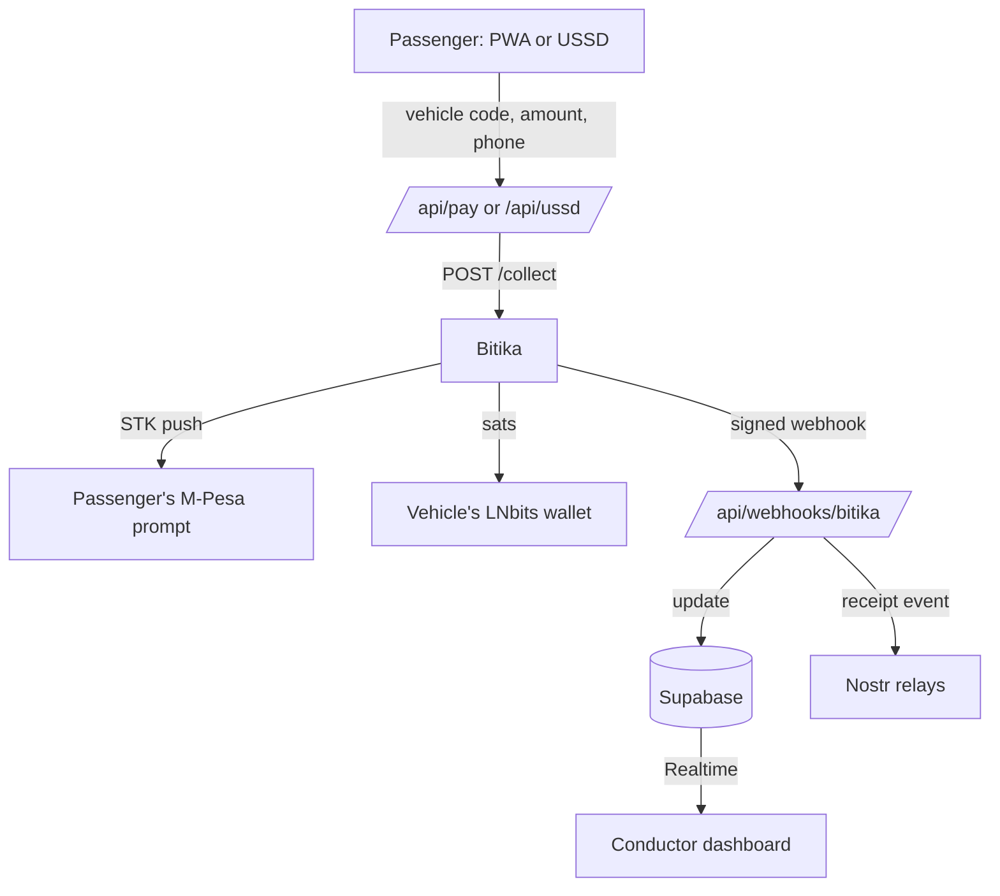

 <div align="center">

# SAFARIPAP

### Bitcoin Lightning fare payments for Kenyan matatus

Pay with ordinary M-Pesa. Settle instantly in Bitcoin, straight into the vehicle's own wallet.

<br />


<br />

[The Problem](#the-problem) &nbsp;|&nbsp; [The Solution](#the-solution) &nbsp;|&nbsp; [Why Lightning](#why-lightning-and-why-bitcoin) &nbsp;|&nbsp; [How It Works](#how-it-works) &nbsp;|&nbsp; [Security](#security-model) &nbsp;|&nbsp; [Setup](#local-setup) &nbsp;|&nbsp; [Status](#project-status)

</div>

<br />

---

## At a Glance

| | |
| :-- | :-- |
| **Passenger** | Scans a QR code or dials a USSD code, then pays with M-Pesa from their own phone |
| **Conductor** | Watches fares land on a live dashboard, with no need to inspect anyone's phone |
| **Owner or SACCO** | Receives fares as Bitcoin into a wallet tied to one specific vehicle |
| **Transparency** | Every successful payment publishes a public receipt event to Nostr |

---

## The Problem

Paying a matatu fare by M-Pesa today usually means handing your phone, or at least its screen, to a stranger. The passenger sends the money, then shows the confirmation to the conductor, who checks it by eye against the fare.

| Issue | What happens |
| :-- | :-- |
| **Exposure** | The conductor sees the passenger's phone, and with it their balance, transaction history and contacts. Passengers seen carrying money or a valuable phone become easier targets for theft and social engineering, on the vehicle and after they get off. |
| **Friction** | Every payment needs manual confirmation, one passenger at a time, while the vehicle is loading or moving. This slows boarding and leads to queues, disputes and missed fares. |
| **Trust** | A message on a screen is easy to fake, and the conductor has no independent way to confirm that money actually arrived. Owners and SACCOs have no reliable per-vehicle record of what each matatu earned. |

---

## The Solution

Safaripap removes the phone-showing step. The passenger pays from their own phone, using a QR code or a USSD code, and never has to hand the device to anyone. The fare then appears on the conductor's live dashboard, driven by a signed payment confirmation from the payment provider rather than a screen shown by the passenger.

Each successful payment is settled as Bitcoin into that specific vehicle's own Lightning wallet, and a public receipt is published to Nostr. The passenger is not exposed, the conductor confirms against a trusted source, and the owner gets a clear record per vehicle.

---

## Why Lightning and Why Bitcoin

Safaripap is not a payments app with Bitcoin attached. The design depends on properties that ordinary payment rails do not give a matatu.

| Property | What it means for a matatu |
| :-- | :-- |
| **Each vehicle holds its own funds** | Every matatu has its own Lightning wallet and Lightning Address. Fares settle directly into it, with no shared till or paybill account between the passenger and the vehicle. Funds can be withdrawn to a Lightning wallet the owner controls. |
| **Built for small, fast payments** | Lightning settles low-value payments in seconds, which suits fares of a few tens of shillings. |
| **Open and borderless** | Bitcoin and Lightning are open protocols. A SACCO is not tied to one provider's platform to hold or move its earnings. |
| **Public, checkable record** | Receipts are published to Nostr, an open protocol with many independent relays. Anyone with the event data can read it without asking Safaripap's permission. |
| **Familiar for the passenger** | The passenger still pays with M-Pesa. There is no new wallet, no seed phrase and no learning curve. Bitcoin is the settlement layer underneath. |

---

## Who It Serves

<table>
  <tr>
    <td width="33%" valign="top">
      <h4>Passengers</h4>
      Pay a fare without handing over their phone, so balances and contacts stay private. Works from a QR code on a smartphone or a USSD code on any phone, including feature phones with no internet.
    </td>
    <td width="33%" valign="top">
      <h4>Conductors</h4>
      See each fare arrive on a live dashboard scoped to their own vehicle, without inspecting passengers' phones or relying on screenshots. Sign in with a vehicle code and PIN.
    </td>
    <td width="33%" valign="top">
      <h4>SACCOs and Owners</h4>
      Receive fares into a wallet tied to a specific vehicle, with a public receipt for each payment. A dashboard with daily per-vehicle totals is planned.
    </td>
  </tr>
</table>

---

## How It Works



| Step | Stage | Description |
| :-: | :-- | :-- |
| 1 | **Initiate** | The passenger opens a vehicle link (`/pay/<vehicleCode>`), typically from a QR code inside the vehicle, or dials a USSD code (`*XXX#`) from any phone. |
| 2 | **Pay** | They enter the fare and their M-Pesa number. The app calls Bitika's `/collect` endpoint. |
| 3 | **Settle** | Bitika triggers the M-Pesa STK push, receives the KES payment, converts it, and forwards it as sats to the vehicle's Lightning Address, hosted on our LNbits instance. |
| 4 | **Verify** | Bitika sends signed webhooks as the payment progresses (`processing_payment` to `fulfilled`, or `failed` / `payment_failed` on decline). The server verifies the HMAC signature on every webhook before updating the transaction in Supabase. |
| 5 | **Monitor** | The conductor signs in at `/login` with a vehicle code and PIN. `/dashboard/<vehicleCode>` shows only that vehicle's fares and updates live through Supabase Realtime. |
| 6 | **Publish** | On a successful payment, a receipt event is published to Nostr relays. |

---

## Security Model

| Concern | How it is handled |
| :-- | :-- |
| **M-Pesa PIN** | Entered only on Safaricom's own STK prompt on the passenger's phone. Safaripap never displays a PIN field and never receives or stores a PIN. |
| **Payment authenticity** | Every Bitika webhook is verified with an HMAC signature before the transaction is updated. Status changes are never accepted on trust. |
| **Conductor access** | Conductors sign in with a vehicle code and PIN. Each dashboard is scoped to a single vehicle and enforced by Supabase Row Level Security, not just by the interface. |
| **Privileged keys** | The Supabase service role key and Bitika credentials exist only on the server. The browser uses the anon key, limited by Row Level Security. |
| **Funds custody** | Each vehicle has its own LNbits wallet, so one vehicle's funds are not pooled with another's. |
| **Relay failures** | Nostr publishing is non-blocking. A slow or unavailable relay never delays or fails the webhook response. |
| **Input handling** | Phone numbers are normalized server-side (`07`, `01` and `254` formats are accepted) before reaching the payment provider. |

> [!WARNING]
> Never commit `.env`. It is listed in `.gitignore`; verify this before every push.

---

## Technology

| Layer | Technology | Purpose |
| :-- | :-- | :-- |
| Application | Next.js 14 (App Router), TypeScript, Tailwind | Passenger PWA, conductor dashboard, API routes |
| Data | Supabase (Postgres and Realtime) | SACCOs, vehicles, transactions, live dashboard feed |
| Payments | [Bitika](https://bitika.xyz) | M-Pesa to Lightning bridge |
| Custody | LNbits | One Lightning wallet and Lightning Address per vehicle |
| Transparency | Nostr | Public payment receipt events |
| Access | Africa's Talking | USSD channel for passengers without smartphones |

<details>
<summary><strong>Repository structure</strong></summary>

<br />

```
src/
  app/
    pay/[vehicleCode]/page.tsx          Passenger PWA
    dashboard/[vehicleCode]/page.tsx    Conductor dashboard (Supabase Realtime)
    api/
      pay/route.ts                      PWA payment initiation
      ussd/route.ts                     Africa's Talking USSD webhook
      webhooks/bitika/route.ts          Bitika status webhook (signature-verified)
      transactions/[code]/route.ts      Status polling for the PWA
      vehicles/[code]/route.ts          Vehicle lookup
  lib/
    bitika.ts                           Bitika API client
    supabase-admin.ts                   Server-side Supabase client (service role)
    supabase-browser.ts                 Browser Supabase client (anon key)
    phone.ts                            Kenyan phone normalization (07 / 01 / 254 to 254)
    nostr.ts                            Nostr receipt publishing
supabase/
  schema.sql                            Full database schema
```

</details>

---

## Environment Variables

| Variable | Used by | Notes |
| :-- | :-- | :-- |
| `NEXT_PUBLIC_SUPABASE_URL` | Client and server | Supabase project URL |
| `NEXT_PUBLIC_SUPABASE_ANON_KEY` | Client | Supabase anon (public) key |
| `SUPABASE_SERVICE_ROLE_KEY` | Server only | Full-access key. Never expose to the browser |
| `BITIKA_API_KEY` | Server only | Issued from the Bitika developer portal |
| `BITIKA_WEBHOOK_SECRET` | Server only | Signing secret for the registered webhook endpoint. Regenerates if the endpoint is edited or re-added |

---

## Local Setup

**1. Install dependencies**

```bash
npm install
```

**2. Configure the environment.** Create a `.env` file with the variables above.

**3. Apply the database schema.** Run `supabase/schema.sql` in the Supabase SQL editor. On an existing project, run the files in `supabase/migrations/` instead. Then enable Realtime on the `transactions` table under Database, Replication.

**4. Create vehicle wallets.** In LNbits, create a wallet and a variable-amount LNURLp pay link for each vehicle to obtain its Lightning Address.

**5. Register vehicles.** In Supabase, insert one `saccos` row and one `vehicles` row per vehicle, including `lnbits_wallet_id`, `lnbits_invoice_key`, and `lightning_address`.

**6. Create conductor logins.** Running the command again resets the PIN.

```bash
npm run create-conductor <vehicleCode> <6-digit PIN>
```

**7. Start the app and expose it.** Run these in separate terminals.

```bash
npm run dev
ngrok http 3000
```

**8. Register the Bitika webhook.** In the Bitika dashboard, add an endpoint at `<ngrok-url>/api/webhooks/bitika` and copy the signing secret into `.env` as `BITIKA_WEBHOOK_SECRET`.

**9. Connect USSD.** In Africa's Talking, point the sandbox USSD channel callback at `<ngrok-url>/api/ussd`.

---

## Project Status

| Area | Status |
| :-- | :-: |
| Passenger PWA payment flow (`07`, `01`, `254` phone formats) | Working |
| USSD flow via Africa's Talking sandbox simulator, sharing the PWA's payment and webhook logic | Working |
| Bitika webhooks with HMAC verification: success, M-Pesa decline, Lightning payout failure | Working |
| Live conductor dashboard through Supabase Realtime, no refresh required | Working |
| Nostr receipt publishing, non-blocking so a slow relay never delays the webhook | Working |
| Per-vehicle LNbits wallets and Lightning Addresses | Working |
| Landing page | In progress |
| Visual design pass on the PWA and dashboard | In progress |
| SACCO and owner dashboard with daily per-vehicle totals | Planned |
| Live Bitika API key (required before demo day, as the sandbox never moves real money) | Pending approval |

> [!NOTE]
> All "Working" items were confirmed end to end in Bitika's sandbox.

---

<div align="center">

Built for Hack4Freedom by the Lady Lightning team.

</div>
